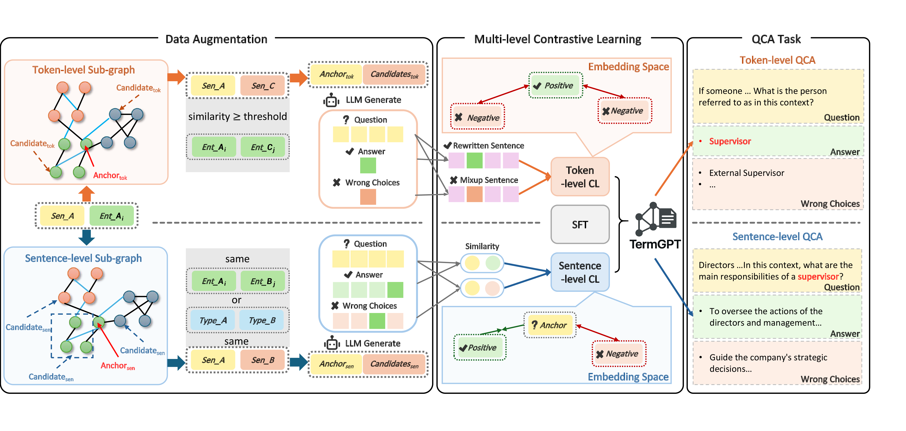

<div align="center">

<h1 align="center">TermGPT: Multi-Level Contrastive Fine-Tuning for Terminology Adaptation in Legal and Financial Domains </h1>

[](https://www.python.org/)
[](https://pytorch.org/)
[](LICENCE)

**A terminology-aware fine-tuning framework based on Sentence Graph-based Data Augmentation and Multi-Level Contrastive Learning**

[Model Architecture](#️-model-architecture) • [Quick Start](#-quick-start) • [Usage Guide](#-usage-guide) • [Validation](#-validation)

</div>

---

## 📋 Table of Contents

- [✨ Features](#-features)
- [🏗️ Model Architecture](#️-model-architecture)
- [🚀 Quick Start](#-quick-start)
  - [Environment Setup](#environment-setup)
- [📖 Usage Guide](#-usage-guide)
  - [Step 1: Sentence Graph-based Data Augmentation](#step-1-sentence-graph-based-data-augmentation)
  - [Step 2: Multi-level Contrastive Learning](#step-2-multi-level-contrastive-learning)
  - [Step 3: Model Validation](#step-3-model-validation)
- [📚 Documentation](#-documentation)
- [📄 License](#-license)

---

## ✨ Features

- 🎯 **Multi-level Contrastive Learning**: Contrastive learning at both sentence-level and token-level to enhance model understanding of domain-specific terminology
- 📊 **Graph-based Data Augmentation**: High-quality data augmentation leveraging sentence graph structures
- 🔄 **Terminology Adaptation**: Specialized fine-tuning for legal and financial domain terminology
- ⚡ **Efficient Training**: Support for DeepSpeed and distributed training
- 📈 **Dual Validation**: Model validation in both QA and QCA formats

---

## 🏗️ Model Architecture

<div align="center">



*TermGPT Model Architecture*

</div>

---

## 🚀 Quick Start

### Environment Setup

First, create and activate the required conda environments:

```bash
# Create base environment
conda env create -f envs/termgpt.yml

# Create multi-level contrastive learning environment
conda env create -f envs/multicl.yml
```

---

## 📖 Usage Guide

### Step 1: Sentence Graph-based Data Augmentation

#### 1.1 Activate Environment

```bash
conda activate termgpt
```

#### 1.2 Construct Sentence Graph

```bash
cd GraphConstruct

python graph.py \
    --rulePath <rule_path> \
    --schemaPath <schema_path> \
    --erPath <er_path> \
    --embedPath <embed_path>
```

#### 1.3 Perform Data Augmentation

```bash
cd QCAconstruct

python construct.py \
    --datasetDir <your_dataset_path> \
    --senMessage <your_sentence_message_path> \
    --tokMessage <your_token_message_path> \
    --mixclDir <your_output_mixcl_data_path> \
    --resultQCA <your_result_path>
```

> 💡 **Tip**: For more details, refer to [GraphConstruct Documentation](GraphConstruct/README.md) and [QCAconstruct Documentation](QCAconstruct/README.md)

---

### Step 2: Multi-level Contrastive Learning

#### 2.1 Activate Environment

```bash
conda activate multicl
cd Multi-CL
```

#### 2.2 Sentence-level Contrastive Learning

```bash
# Step 1: Start MNTP training (before CL)
DS_SKIP_CUDA_CHCK=1 deepspeed --include localhost:0,1 experiments/run_mntp.py -c <data_path>

# Step 2: Data preprocessing
python scripts/wash.py \
    --rawPath <raw_path> \
    --outputPath <output_path>

# Step 3: Train the model
torchrun --nproc_per_node=<num_gpus> experiments/cl-sentence.py <data_path>
```

#### 2.3 Token-level Contrastive Learning

```bash
# Step 1: Data preprocessing
python scripts/mixup.py \
    -r <raw_data_path> \
    -m <mix_data_path>

# Step 2: Train the model
deepspeed --include localhost:0,1 \
    experiments/cl-token.py <mix_data_path>
```

> 💡 **Tip**: For more details, refer to [Multi-CL Documentation](Multi-CL/README.md)

---

### Step 3: Model Validation

#### 3.1 Activate Environment

```bash
conda activate termgpt
```

#### 3.2 QA Format Validation

```bash
cd validation_qa

python eval.py \
    --model_name <model_name> \
    --output_path <output_path> \
    --data_path <data_path> \
    --bert_path <bert_path> \
    --batch_size <batch_size> \
    --max_length <max_length> \
    --top_p <top_p> \
    --top_k <top_k> \
    --temperature <temperature> \
    --api_key <api_key>
```

#### 3.3 QCA Format Validation

```bash
cd validation_choice

python eval.py \
    --model_name <model_name> \
    --output_path <output_path> \
    --data_path <data_path> \
    --batch_size <batch_size> \
    --max_length <max_length> \
    --top_p <top_p> \
    --top_k <top_k> \
    --temperature <temperature>
```

> 💡 **Tip**: For more details, refer to [QA Validation Documentation](validation_qa/README.md) and [QCA Validation Documentation](validation_choice/README.md)

---

## 📚 Documentation

| Module | Description | Documentation |
|:---:|:---:|:---:|
| **GraphConstruct** | Sentence graph construction | [📖 View Docs](GraphConstruct/README.md) |
| **QCAconstruct** | Data augmentation | [📖 View Docs](QCAconstruct/README.md) |
| **Multi-CL** | Multi-level contrastive learning | [📖 View Docs](Multi-CL/README.md) |
| **validation_qa** | QA format validation | [📖 View Docs](validation_qa/README.md) |
| **validation_choice** | QCA format validation | [📖 View Docs](validation_choice/README.md) |
| **SFT** | Supervised fine-tuning | [📖 View Docs](SFT/README.md) |

---

## 📄 License

This project is licensed under the [MIT License](LICENCE).

---

<div align="center">

**⭐ If this project helps you, please give it a Star!**

</div>
